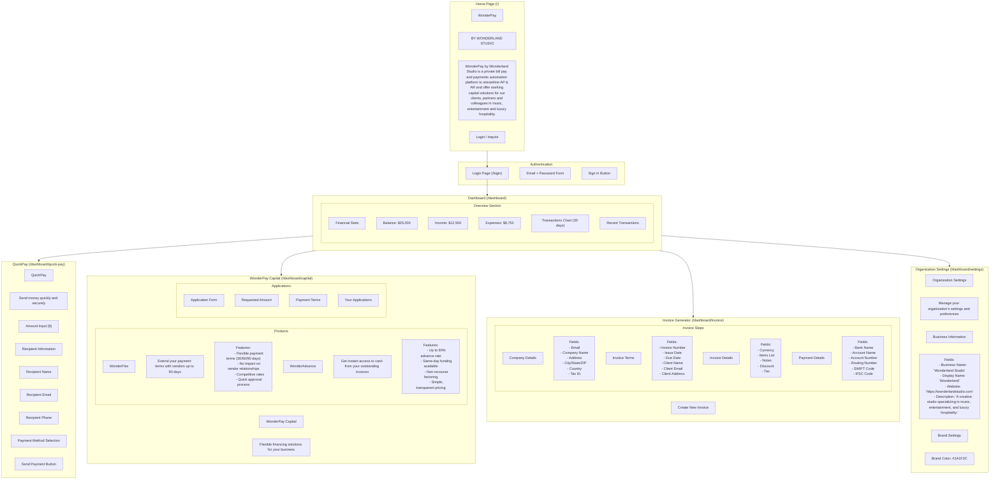

# WonderPay Frontend Structure Documentation



## Detailed Component Structure

### 1. Navigation
- **Sidebar Navigation**
  - Dashboard
  - QuickPay
  - Capital
  - Invoice Generator
  - Settings
- **Top Navigation**
  - User Profile
  - Notifications
  - Help

### 2. Home Page (/)
- **Header**
  ```html
  <h1>WonderPay</h1>
  <p>BY WONDERLAND STUDIO</p>
  ```
- **Description**
  ```html
  <p>WonderPay by Wonderland Studio is a private bill pay and payments automation platform to streamline AP & AR and offer working capital solutions for our clients, partners and colleagues in music, entertainment and luxury hospitality.</p>
  ```
- **Buttons**
  - Login (Primary Button)
  - Inquire (Secondary Button)

### 3. Login Page (/login)
- **Title**: "Sign in to your account"
- **Form Fields**
  - Email Address (Required)
  - Password (Required)
- **Button**: "Sign in"

### 4. Dashboard (/dashboard)
#### Overview Section
- **Financial Cards**
  - Balance
    ```html
    <h3>Balance</h3>
    <p>$25,000</p>
    ```
  - Income
    ```html
    <h3>Income</h3>
    <p>$12,500</p>
    <span>+15% from last month</span>
    ```
  - Expenses
    ```html
    <h3>Expenses</h3>
    <p>$8,750</p>
    <span>-5% from last month</span>
    ```

- **Transactions Chart**
  - 30-day view by default
  - Period selector: 7d, 30d, 90d, 1y

- **Recent Transactions**
  - Table Headers:
    - Description
    - Invoice Number
    - Status
    - Date
    - Amount

### 5. QuickPay (/dashboard/quick-pay)
- **Header**
  ```html
  <h1>QuickPay</h1>
  <p>Send money quickly and securely</p>
  ```

- **Payment Form**
  - Amount Section
    ```html
    <label>Amount</label>
    <input type="number" placeholder="0.00" />
    ```
  - Recipient Section
    ```html
    <label>Recipient Name</label>
    <input type="text" required />
    
    <label>Recipient Email</label>
    <input type="email" />
    
    <label>Recipient Phone</label>
    <input type="tel" />
    ```
  - Payment Method Section
    - Standard Payment Options
    - WonderPay Capital Options
      - 30-day terms (1% fee)
      - 60-day terms (2% fee)
      - 90-day terms (3% fee)

### 6. WonderPay Capital (/dashboard/capital)
- **Header**
  ```html
  <h1>WonderPay Capital</h1>
  <p>Flexible financing solutions for your business</p>
  ```

- **Products**
  - WonderFlex Card
    ```html
    <h2>WonderFlex</h2>
    <p>Extend your payment terms with vendors up to 90 days</p>
    <ul>
      <li>Flexible payment terms (30/60/90 days)</li>
      <li>No impact on vendor relationships</li>
      <li>Competitive rates</li>
      <li>Quick approval process</li>
    </ul>
    ```
  - WonderAdvance Card
    ```html
    <h2>WonderAdvance</h2>
    <p>Get instant access to cash from your outstanding invoices</p>
    <ul>
      <li>Up to 90% advance rate</li>
      <li>Same-day funding available</li>
      <li>Non-recourse factoring</li>
      <li>Simple, transparent pricing</li>
    </ul>
    ```

- **Application Form**
  ```html
  <h3>Apply for [Product Name]</h3>
  <label>Requested Amount</label>
  <input type="number" />
  <label>Payment Terms</label>
  <select>
    <option>30 days</option>
    <option>60 days</option>
    <option>90 days</option>
  </select>
  ```

### 7. Invoice Generator (/dashboard/invoice)
- **Header**
  ```html
  <h1>Create New Invoice</h1>
  ```

- **Step Navigation**
  - Company Details
  - Invoice Terms
  - Invoice Details
  - Payment Details

- **Form Fields** (by step)
  1. Company Details
     ```html
     <input placeholder="Email" />
     <input placeholder="Company Name" />
     <input placeholder="Address" />
     <input placeholder="City" />
     <input placeholder="State" />
     <input placeholder="ZIP" />
     <input placeholder="Country" />
     <input placeholder="Tax ID" />
     ```

  2. Invoice Terms
     ```html
     <input placeholder="Invoice Number" />
     <DatePicker label="Issue Date" />
     <DatePicker label="Due Date" />
     <input placeholder="Client Name" />
     <input placeholder="Client Email" />
     <textarea placeholder="Client Address" />
     ```

  3. Invoice Details
     ```html
     <select label="Currency">
       <option>USD</option>
       <option>EUR</option>
       <option>GBP</option>
     </select>
     
     <div class="items-list">
       <input placeholder="Description" />
       <input type="number" placeholder="Quantity" />
       <input type="number" placeholder="Price" />
     </div>
     
     <input type="number" placeholder="Discount" />
     <input type="number" placeholder="Tax %" />
     ```

  4. Payment Details
     ```html
     <input placeholder="Bank Name" />
     <input placeholder="Account Name" />
     <input placeholder="Account Number" />
     <input placeholder="Routing Number" />
     <input placeholder="SWIFT Code" />
     <input placeholder="IFSC Code" />
     ```

### 8. Organization Settings (/dashboard/settings)
- **Header**
  ```html
  <h1>Organization Settings</h1>
  <p>Manage your organization's settings and preferences</p>
  ```

- **Form Fields**
  ```html
  <label>Business Name</label>
  <input value="Wonderland Studio" />
  
  <label>Display Name</label>
  <input value="Wonderland" />
  
  <label>Website</label>
  <input value="https://wonderlandstudio.com" />
  
  <label>Description</label>
  <textarea>A creative studio specializing in music, entertainment, and luxury hospitality.</textarea>
  
  <label>Brand Color</label>
  <input type="color" value="#1A1F2C" />
  ```

## Common UI Elements

### Buttons
```html
<!-- Primary Button -->
<button class="bg-[#1A1F2C] hover:bg-[#403E43] text-white">
  Primary Action
</button>

<!-- Secondary Button -->
<button class="bg-[#9b87f5] hover:bg-[#8B5CF6] text-white">
  Secondary Action
</button>

<!-- Outline Button -->
<button class="border border-gray-300 hover:bg-gray-50">
  Tertiary Action
</button>
```

### Form Elements
```html
<!-- Input Field -->
<input class="rounded-md border-gray-300 focus:border-indigo-500" />

<!-- Select Field -->
<select class="rounded-md border-gray-300 focus:border-indigo-500">
  <option>Option 1</option>
</select>

<!-- Checkbox -->
<input type="checkbox" class="rounded border-gray-300" />

<!-- Radio Button -->
<input type="radio" class="border-gray-300" />
```

### Cards
```html
<div class="bg-white/80 backdrop-blur-sm border border-gray-100 rounded-lg p-6">
  <h3>Card Title</h3>
  <p>Card content</p>
</div>
```

### Typography
```html
<!-- Headings -->
<h1 class="text-4xl font-bold text-gray-900">Page Title</h1>
<h2 class="text-2xl font-semibold text-gray-900">Section Title</h2>
<h3 class="text-xl font-medium text-gray-900">Subsection Title</h3>

<!-- Body Text -->
<p class="text-base text-gray-600">Regular text</p>
<p class="text-sm text-gray-500">Small text</p>
```

### Notifications
```html
<!-- Success Toast -->
<div class="bg-green-50 text-green-800 rounded-md p-4">
  Success message
</div>

<!-- Error Toast -->
<div class="bg-red-50 text-red-800 rounded-md p-4">
  Error message
</div>
```

### Loading States
```html
<!-- Spinner -->
<div class="animate-spin h-5 w-5">
  <svg><!-- Spinner SVG --></svg>
</div>

<!-- Loading Text -->
<p class="text-gray-500">Loading...</p>
```

This documentation provides a comprehensive overview of all UI components, their exact content, styling, and relationships within the WonderPay frontend application. 